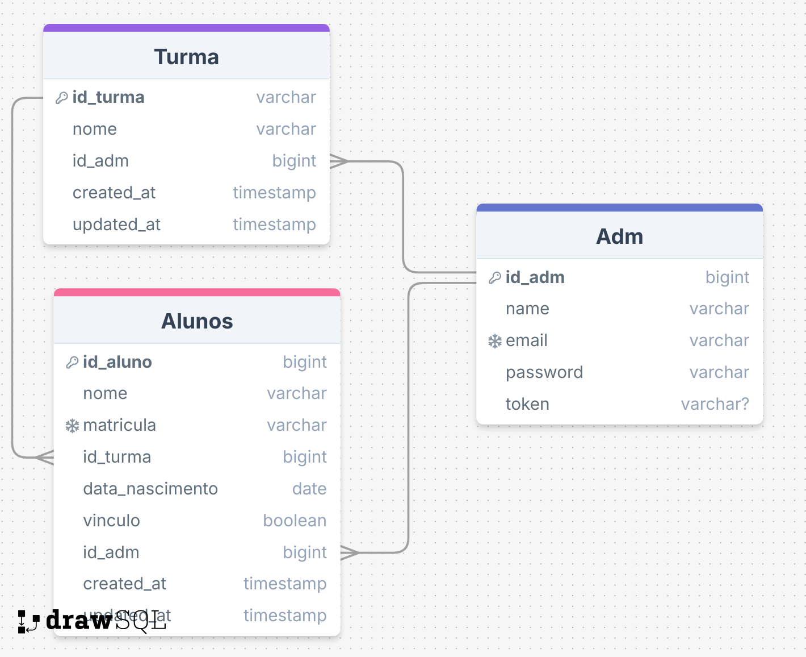

# cadastro-e-gerenciamento-de-alunos

## 🔍 Sobre o Projeto

#### Este projeto foi desenvolvido com o objetivo de criar um sistema de cadastro e gerenciamento de alunos com ferramentas e tecnologias aprendidas na disciplina de Back-End.

### Descrição:
   
- Cadastro de alunos (nome, matrícula, turma).
-  Edição e exclusão de cadastros.
- Listagem de todos os alunos.
- Consulta por nome ou matrícula.
  

# 📦 Configuração do Ambiente de Desenvolvimento


Primeiro, confira se o `node` está acima da versão 14:

```bash
node -v
```

Para criar o projeto, use:

```bash
npm init adonis-ts-app@latest api
```

Caso não dê certo com `npm`, utilize o `yarn`. Primeiro, instale o `yarn` utilizando o comando:

```bash
npm install -g yarn
```

Depois, execute o comando para criar o projeto:

```bash
yarn create adonis-ts-app api
```

Selecione a estrutura de projeto “api”, coloque o nome de “api”, coloque `true` para o uso de eslint e `true` para o uso de prettier.

## 🗄️ Parte de Database

Instalação do Lucid, que é o ORM que o Adonis trabalha:

```bash
yarn add @adonisjs/lucid@18.4.0
```

Depois de instalar a biblioteca, é necessário configurá-la:

```bash
node ace configure @adonisjs/lucid
```

Selecione o `PostgreSQL` utilizando a barra de espaço. Depois, escolha onde quer que sejam exibidas as informações de variáveis de ambiente, no `terminal` ou no `browser`.

Como vou utilizar PostgreSQL, é necessário incluir as variáveis no arquivo `env.ts`:

```typescript
PG_HOST: Env.schema.string({ format: 'host' }),
PG_PORT: Env.schema.number(),
PG_USER: Env.schema.string(),
PG_PASSWORD: Env.schema.string.optional(),
PG_DB_NAME: Env.schema.string(),
```

### 🐳 Criar um Banco de Dados no Docker

Inicialize o Docker e inicie o container:

```bash
docker start [CONTAINER_NAME] ou [CONTAINER_ID]
```

Depois, use `docker exec` para rodar o SQL no PostgreSQL:

```bash
docker exec -it postgres sql -U postgres
```

Então, crie uma database:

```sql
create database todo;
```

Para sair, use:

```sql
\q
```

Depois, coloque as informações no arquivo `.env`.

## 🔐 Autenticação

Instale a autenticação:

```bash
yarn add @adonisjs/auth@8.2.3
```

E também deve ser feita a configuração:

```bash
node ace configure @adonisjs/auth
```

Ele pergunta qual será o provedor: `Lucid` (ORM padrão do AdonisJS) ou `QueryBuilder`. No caso, utilize o `Lucid`.

Ele pergunta qual o tipo de tokens (Web, API tokens ou Basic Auth). Será utilizado o API tokens, que é uma melhoria do JWT.

Pergunta qual o nome do model que será utilizado para autenticação. O nome será `Adm`.
Pergunta se quer criar a migration de Adm

Pergunta onde gravar os tokens: no `Redis` (banco de dados de alto desempenho baseado em chave-valor) ou utilizar uma própria database. Como será utilizada uma database própria, criamos uma migration `api_tokens`.

Agora, replicar o modelo do banco de dados para a migration:



 É necessário criar uma migration para alunos, usando o comando:

```bash
node ace make:model Alunos -c -m
```

Tambem necessário criar uma migration para alunos, usando o comando:

```bash
node ace make:model Turma -c -m
```

Poderia ter sido criado o model, o controller e a migration separadamente, mas com esse comando é criado tudo de uma vez só.

Depois, faça as alterações nos models `Adm.ts` , `Aluno.ts`e `Turma.ts` e faça o relacionamento entre as tabelas:

Aluno: 
```
  @belongsTo(() => Turma)
  public turma: BelongsTo<typeof Turma>
```
Turma:
```
  @hasMany(() => Aluno)
  public alunos: HasMany<typeof Aluno>
```
Adm:
```
 @hasMany(() => Aluno)
  public alunos: HasMany<typeof Aluno>

  @hasMany(() => Turma)
  public turmas: HasMany<typeof Turma>

```

## 🔍 Acessando o PostgreSQL

Execute novamente o comando para entrar no PostgreSQL:

```bash
docker exec -it postgres sql -U postgres
```

Use o comando para abrir a database:

```sql
\c [NOME_DO_BANCO]
```

Após entrar no banco, execute:

```sql
\dt
```

Para mostrar quais tabelas estão no database.

Caso queira ver somente uma tabela, execute o comando:

```sql
\d [NOME_DA_TABELA]
```

## 🛠️ Criando Controller de User

```bash
node ace make:controller User -r
```

Importação do Adm para o controller:

```typescript
import User from 'App/Models/Adm'
```

Depois, faça as construções dos métodos.

O Adm precisa ser autenticado para verificar as permissoes de alterações de dados.

```bash
node ace make:controller Session -r
```


## 🚀 Criação das Rotas

### Criação das Rotas de Usuário e Autenticação

Utilizando o comando:

```bash
Route.resource('/adm', 'AdmsController').apiOnly()
```

Conseguimos criar as 5 rotas de uma vez só. Para visualizar as rotas, use o código abaixo:

```bash
node ace list:routes
```


## 🏃 Executando o Projeto

Para rodar o projeto, utilize o comando:

```bash
yarn dev
```

## 🔒 Criando Middleware de Autenticação